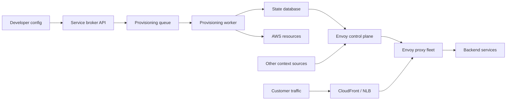

# Platform Engineering

Platform engineering turns repeated infrastructure work into a product that
application teams can use safely through small, stable interfaces.

## Self-Service Edge Load Balancing

Source note:

- [I was laid off by Atlassian](https://www.youtube.com/watch?v=55pTFVoclvE)
  by Vasilios Syrakis

Related primary references:

- [Open Service Broker API specification](https://github.com/openservicebrokerapi/servicebroker)
- [Envoy xDS configuration API overview](https://www.envoyproxy.io/docs/envoy/latest/intro/arch_overview/operations/dynamic_configuration)
- [AWS CloudFormation](https://docs.aws.amazon.com/AWSCloudFormation/latest/UserGuide/Welcome.html)
- [HashiCorp Packer](https://developer.hashicorp.com/packer/docs)

This is a learning note from a public engineering retrospective, not an
official Atlassian architecture document.

### Problem

Internal product teams need to expose services publicly, route traffic, attach
certificates, protect the edge, log requests, and apply auth, authorization, and
rate limiting. If every team implements those concerns directly, the company
pays the cost many times and gets inconsistent behavior.

The platform goal is to make edge exposure self-service:

- developers declare a small amount of intent;
- the platform provisions and validates the real infrastructure;
- common edge concerns are handled once, close to the request entry point;
- product teams keep focusing on their service behavior.

### Shape Of The System

The video describes a platform built around a service broker, async
provisioning, an Envoy control plane, and an Envoy proxy fleet.

The important split:

- Control plane: service broker API, worker, queue, state database, templates,
  validation, Envoy xDS management server, image build pipeline.
- Data plane: CloudFront or network load balancer, Envoy proxies, sidecars,
  backend services.
- Build plane: Packer and configuration management produce an AMI with Envoy,
  observability agents, hardening, network tuning, containers, and sidecars.

### Service Broker Pattern

The broker is the product API for the platform. It accepts provisioning,
updating, deleting, binding, and status requests. It hides the underlying
resources from application teams.

In the case study:

- the broker was implemented as a web API;
- long-running provisioning was pushed to a queue;
- a worker performed real provisioning work;
- state was stored in a database;
- callers polled for completion.

This is useful because creating DNS records, CloudFront distributions, network
resources, certificates, or proxy configuration is slower and riskier than a
normal request-response API call.

### Dynamic Envoy Control Plane

Envoy can receive dynamic configuration through xDS. That makes it possible to
run a fleet of proxies and update routing, clusters, listeners, endpoints,
secrets, and runtime behavior without rebuilding every proxy.

In the case study, the control plane combined:

- templates for Envoy resource types;
- context from broker state and other sources;
- validation before template rendering;
- generated config delivered to the proxy fleet.

The platform API should expose simple parameters, not raw Envoy complexity, but
the platform must still validate that those parameters produce valid and safe
Envoy resources.

### Image And Infrastructure Pipeline

The proxy fleet was provisioned through infrastructure as code. The AMI was a
separate artifact built with an image pipeline, then referenced by the
infrastructure template.

The image contained the common runtime pieces:

- Envoy install and base configuration;
- logging, metrics, and tracing agents;
- security hardening;
- network tuning;
- containers and sidecar support;
- runtime hooks for secrets and environment-specific parameters.

This separates slow machine preparation from faster service-specific config
changes.

### Centralized Cross-Cutting Concerns

Once traffic goes through a common edge, the platform can solve concerns before
requests reach backend services:

- DDoS protection;
- access logging;
- authentication;
- authorization;
- rate limiting;
- header and routing policy;
- websocket and HTTP connection behavior.

Some concerns can run natively in Envoy filters. Others can run through sidecars
or external processing services. This lets specialized teams own one concern
centrally instead of asking every product team to rebuild it.

### Design Lessons

- Treat platform infrastructure as a product, with an API, documentation,
  support model, migration plan, and clear success criteria.
- Keep the developer-facing input small, but make validation strict.
- Use async provisioning for work that touches cloud resources or network
  control planes.
- Separate desired state from runtime config generation.
- Separate control plane changes from data plane traffic serving.
- Use templates to reduce repeated config, but test the rendered output.
- Prefer a golden-image or base-image flow for heavy bootstrap concerns.
- Centralize repeated edge concerns only when the platform team can support the
  operational blast radius.
- Migration is part of the design. A platform is not done when the first path
  works; it is done when real teams can move onto it safely.

### Failure Modes To Design For

- The queue is unavailable, so new provisioning work cannot start.
- The worker fails halfway through a provisioning task.
- The state database is unavailable or stale.
- The control plane generates invalid Envoy config.
- The control plane generates valid config that is logically bad and breaks
  traffic.
- Envoy cannot reach the management server and must continue with stale config
  or expire resources intentionally.
- A new AMI has a bad agent, sidecar, kernel setting, or bootstrap script.
- A sidecar has a bad release and affects many services at once.
- A migration path exposes services accidentally or weakens protection.
- The centralized platform becomes a single high-blast-radius dependency.

Useful safeguards:

- idempotent provisioning tasks;
- retries with clear ownership of partial work;
- rendered-config validation;
- config versioning and rollback;
- canary proxy pools;
- traffic and error-rate alarms;
- runbooks for bad config, stale config, and cloud dependency failures;
- explicit public-exposure declarations;
- compatibility tests for sidecars and Envoy versions.

### Interview Storytelling

This case study is useful for senior/full-stack and platform/system-design
interviews because it shows ownership beyond feature work.

A strong story shape:

1. Problem: internal teams needed safe, self-service public traffic exposure.
2. Constraints: many services, many teams, cloud resources, edge security,
   migrations, and operational risk.
3. Design: broker API, queue, worker, state store, dynamic Envoy control plane,
   image pipeline, and proxy fleet.
4. Tradeoffs: centralization improves consistency but increases platform blast
   radius.
5. Reliability: validation, rollback, canaries, observability, and runbooks.
6. Outcome: product teams get a smaller interface while the platform owns
   complex edge behavior.
7. Learning: building v1 is easier than maintaining it, onboarding others, and
   keeping it changeable over years.

Practice prompts:

- Design a self-service load-balancing platform for internal microservices.
- How would you expose a service publicly while preventing accidental exposure?
- How would you roll out a new Envoy configuration template safely?
- What happens when the provisioning worker succeeds in AWS but fails before
  writing state?
- Which concerns belong in the platform edge, and which should stay in each
  backend service?
- How would you migrate legacy load balancers to a centralized edge platform?
